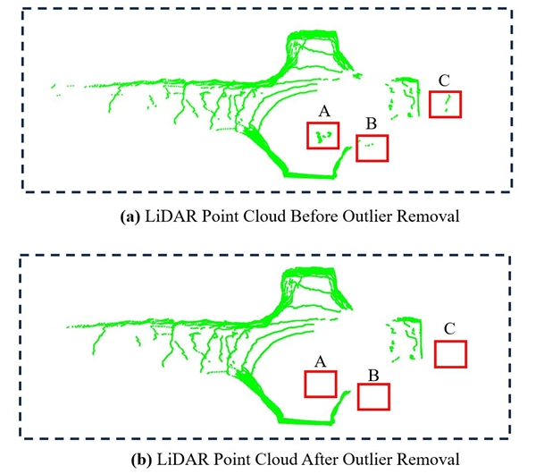
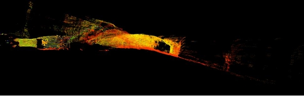
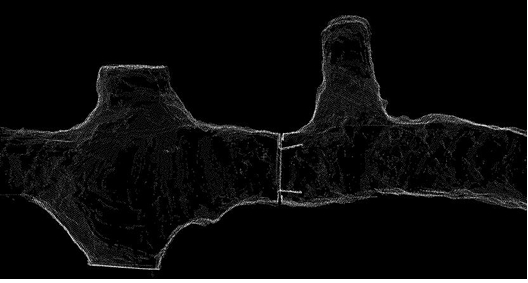
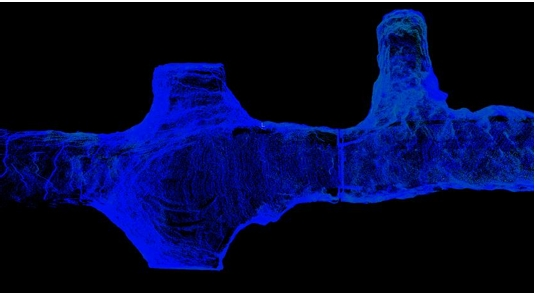
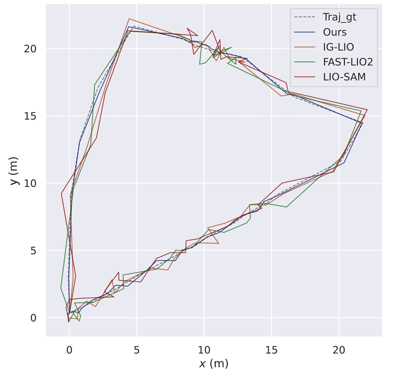

#  MineSLAM：基于LIO-SAM的非煤矿井危险征兆智能巡检无人车

该项目来源于国家重点研发计划项目：**《地下非煤矿山危险征兆智能巡检关键技术及装备2021YFC3001302》** 子课题。**MineSLAM** 是一套面向非煤矿井复杂地下环境的智能巡检机器人系统，搭载基于LIO-SAM的改进算法，结合激光雷达、IMU、双目相机等导航定位传感器，以及透水、地压、有毒气体传感器，用于识别潜在危险征兆。实现无人化自主巡检，提高矿井安全管理效率。该项目与**山东黄金集团**展开合作，以山东莱州焦家金矿为示范矿区完成应用示范及验收工作。该系统以**自研履带式无人车**为平台，适用于狭窄、不平整、无GPS信号的地下矿井环境，具备高鲁棒性的实时定位与智能识别能力。

---

##  项目目标

-  在矿井低光照、退化场景环境下基于 LIO-SAM 实现高精度实时定位与建图（SLAM）

---


## 改进内容

- 设计矿山巡检无人车激光-IMU-相机紧耦合系统，完成井下低光照、高分粉尘环境联合标定，生成LIO-SAM兼容参数文件,支持矿区巷道点云-惯导融合定位。
- 改进LIO-SAM算法：提出基于BFS的离群点去除算法，噪点降低32%。融合IMU角速度优化运动畸变补偿，急转弯场景配准精度提升12%.
- 构建非煤矿井三维点云数据集，并实现定位精度ATE RMSE 0.65m。同步采集1.2TB激光雷达、IMU、温湿度传感器的完整ROS Bag数据
- 开发基于OctoMap的点云-栅格地图转换工具链，生成适配路径规划的二维占据栅格地图，分辨率5cm，部署于山东莱州3座矿山，减少高危巡检1500人次
- 参与项目示范验收，撰写技术文档8份，子课题获专家组"优秀"评价。

---


##  技术栈 & 传感器配置

| 模块            | 工具 / 设备                                |
|-----------------|--------------------------------------------|
| SLAM            | LIO-SAM（基于激光 + 惯性里程计融合）       |
| 主控            | 域控制器（NVIDIA Jetson / x86 工控机）     |
| 激光雷达        | 16线机械式雷达（Velodyne / Robosense）     |
| IMU             | TL740D（瑞芬 IMU）                         |
| 摄像头          | 双目相机（支持立体视觉和深度估计）         |
| 危险检测传感器  | 电磁法透水探头（非SLAM部分）               |
| 气体传感器      | 有毒有害气体检测模块（非SLAM部分）         |

---

## 系统概述
-

### 🚀 快速开始 | Quick Start

> 以下为项目主要功能模块的启动流程与说明（基于 ROS Noetic + LIO-SAM + 实际传感器）

#### 1️⃣ 环境依赖

请确保你已安装以下依赖：

- Ubuntu 20.04 + ROS Noetic
- [LIO-SAM](https://github.com/TixiaoShan/LIO-SAM)
- CMake / catkin_tools
- Velodyne 驱动（适配 16线激光雷达）
- TL740D IMU 驱动
- 双目相机驱动（如 ZED SDK / ROS 包）

#### 2️⃣ 初始化 ROS 工作空间

```bash
mkdir -p ~/mine_slam_ws/src
cd ~/mine_slam_ws/src
catkin_init_workspace
```
#### 3️⃣ 克隆项目并编译
```bash
cd ~/mine_slam_ws/src
git clone https://github.com/yourusername/MineSLAM.git
cd ..
catkin_make
source devel/setup.bash
```
#### 4️⃣ 启动 LIO-SAM SLAM 系统
```bash
roslaunch lio_sam run.launch
```

#### 矿下离群点去除效果


#### LIO-SAM建图效果
-

#### FAST-LIO2建图效果
-

#### 本项目建图效果
-

#### 轨迹对比
-
